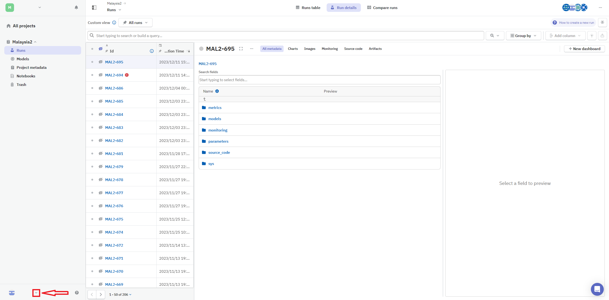
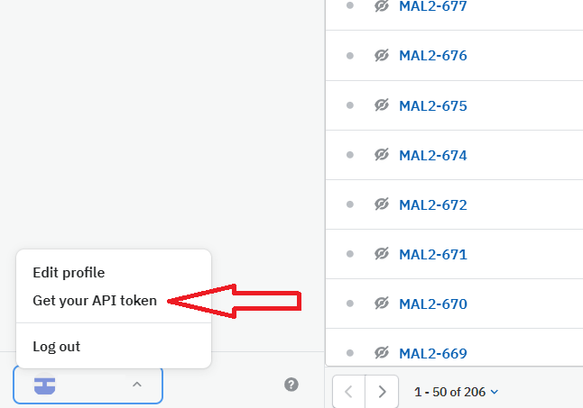
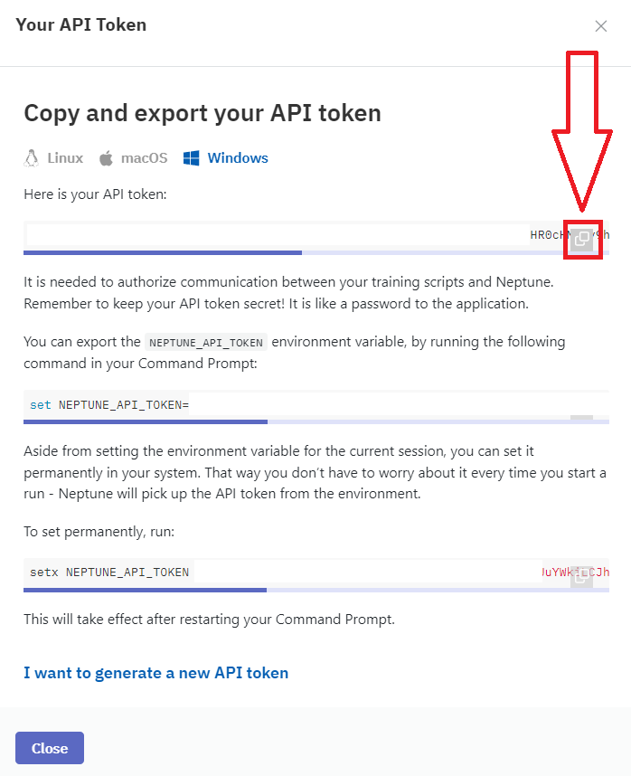

# TABLE OF CONTENTS
1. **[PROJECT REQUIREMENTS](#setup)**
    - 1.1. **[REQUIRED TOOLS / PACKAGES](#requirements)**
    - 1.2. **[HOW TO GET Neptune.ai TOKEN](#neptune_token)**
2. **[HOW TO RUN AN EXPERIMENT](#run_experiment)**
    - 2.1. **[EXAMPLE: HOW TO RUN AN EXPERIMENT](#example_run_experiment)**
3. **[HOW TO VISUALIZE AN EXPERIMENT](#visualization)**
<br></br>


## **1. PROJECT REQUIREMENTS <a name="setup"></a>**

### **1.1. REQUIRED TOOLS / PACKAGES <a name="requirements"></a>**

To run or visualize an experiment you must install:
- Python 3.10,
- **SUMO**, which must be [installed separately](https://sumo.dlr.de/docs/Installing/index.html). SUMO_HOME environment variable must be set, this is done automatically on the install of Sumo on Windows and Ubuntu. **SUMO 1.19.0 has been tested**,
- required packages from the requirements.txt (`pip install -r requirements.txt`)


### **1.2. HOW TO GET Neptune.ai TOKEN <a name="neptune_token"></a>**

* Log in to [Neptune.ai](https://ui.neptune.ai/). In the bottom-left corner, click the arrow (as shown in the screenshot below).


* Click `Get your API token`.


* Click the button highlighted in the image below.


<br></br>


## **2. HOW TO RUN AN EXPERIMENT <a name="run_experiment"></a>**

Get your Neptune.ai token (**see: [HOW TO GET Neptune.ai TOKEN](#neptune_token)**), open `main.py` file and replace `"your_api_token"` in the `neptune.init_run()` method with your token.
```python
run = neptune.init_run(
            api_token="your_api_token",
            project="pgora/Malaysia2",
            name=f"{args.agent}-sumo-v0",
            description=f"Apply {args.agent} algorithm to the sumo-v0 environment",
            tags=[
                "sumo-v0",
                f"{args.agent}",
                f"Net: {args.net}",
                f"Activation: {args.activation}",
                "stable-baselines3",
                # "10 episodes - train, 1 episode - validation on new own generated file",
                "4 phases for PBB_Junc and SIRIM_Junc, 3 phases for INFMain_Junc - Full",
                "no new vehicles after 1 hour",
                f"Reward: {agent_configs[args.agent]['reward'].__name__}",
                # "5e5 steps",
                "7-8 am",
                # "aggregating data from lanes on the same road",
            ],
        )
```
Open the console, navigate to the `resco_benchmark` directory (`cd resco_benchmark`) and enter the following command:

`python main.py --map BB5B`<br></br>
Note that there are also other parameters to set.

<table><tbody>
<tr>
  <th> 
    
  **COMMAND NAME** </th>
  <th> 
    
  **AVAILABLE VALUES** </th>
  <th> 
    
  **DESCRIPTION** </th>
<tr>
  <td>
  --agent
  </td>
  <td>

  * IDQN
  * IPPO
  * STOCHASTIC
  </td>
  <td>
  RL algorithm
  </td>
<tr>
  <td>
    --map
  </td>
  <td> 
  BB5B
  </td>
  <td>
  Available scenario. Currently BB5B is the only available.
  </td>
<tr>
  <td>
    --eps_val
  </td>
  <td>
  Any integer greater than 1
  </td>
  <td>
    
  Expected number of validation episodes. By default every 11th episode will be the validation episode. You can change that by overwriting the `VALIDATION_INTERVAL` variable in `main.py`. 
  </td>
<tr>
  <td>
    --seed
  </td>
  <td>
  Any positive integer
  </td>
  <td>
    Allows to reproduce the results of the experiment. Experiment must be run on the same machine. Otherwise, the results might be different.
  </td>
<tr>
  <td>
    --net
  </td>
  <td>
    
  * _**default**_
  * _**double_conv**_
  </td>
  <td>
    Different PyTorch neural networks.
  </td>
<tr>
  <td>
    --activation
  </td>
  <td>
    
  * _**relu**_
  * _**leaky_relu**_
  * _**tanh**_
  * _**swish**_
  </td>
  <td>
    Different activation functions.
  </td>
<tr>
  <td>
    --gui
  </td>
  <td>
    
  _boolean_
  </td>
  <td>
    Allows to run simulation with visualization in SUMO. False by default.
  </td>
<tr>
  <td>
  log_dir
  </td>
  <td>
  Any directory (string)
  </td>
  <td>
  Location where experiment metrics and simulation data shared from SUMO are saved.
  </td>
<tr>
  <td>
  procs
  </td>
  <td>
  Any positive integer
  </td>
  <td>
  
  Runs the simulation on the provided number of processes. If `procs` is set to 2, it increases simulation performance.
  </td>
<tr>
  <td>
    --load
  </td>
  <td>
    
  _boolean_
  </td>
  <td>

  Loads provided models from `models/models_for_visualization` directory. Used for visualization, but also we can continue training from a checkpoint. To resume training, we need to enable the training mode for the model (for example `agents/pfrl_dqn.py` -> comment out line 34 `self.agents[key].agent.training = False`).
  </td>
<tbody></table>


### **2.1 EXAMPLE: HOW TO RUN AN EXPERIMENT <a name="example_run_experiment"></a>**

To run the experiment, open the console, navigate to the **resco_benchmark** (`cd resco_benchmark`) folder, and enter the following command: <br></br>
`python main.py --agent IDQN --eps_val 10 --map BB5B --seed 42 --net default --activation leaky_relu`
<br></br>


## **3. HOW TO VISUALIZE AN EXPERIMENT <a name="visualization"></a>**

To visualize the model, copy the token from the Neptune.ai (**see: [HOW TO GET Neptune.ai TOKEN](#neptune_token)**), open `main-testagent.py` file and replace `"your_api_token"` in the `neptune.init_run()` method with your token.

```python
run = neptune.init_run(
        api_token="your_api_token",
        project="pgora/Malaysia2",
        with_id=args.experiment_name,
        mode="read-only"
    )
```

After setting the token, open console, navigate to `resco_benchmark` (`cd resco_benchmark`), and enter the command:

`python main-testagent.py --experiment_name MAL2-623`

where `MAL2-623` is the name of the experiment you want to visualize. Training hyperparameters will be passed automatically. Keep in mind that the experiment must have a `models` directory on Neptune.ai. Otherwise, a FileNotFoundError will be returned.
