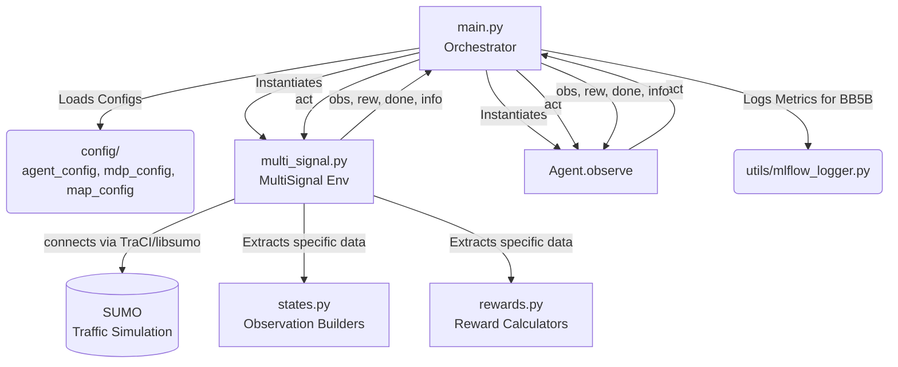
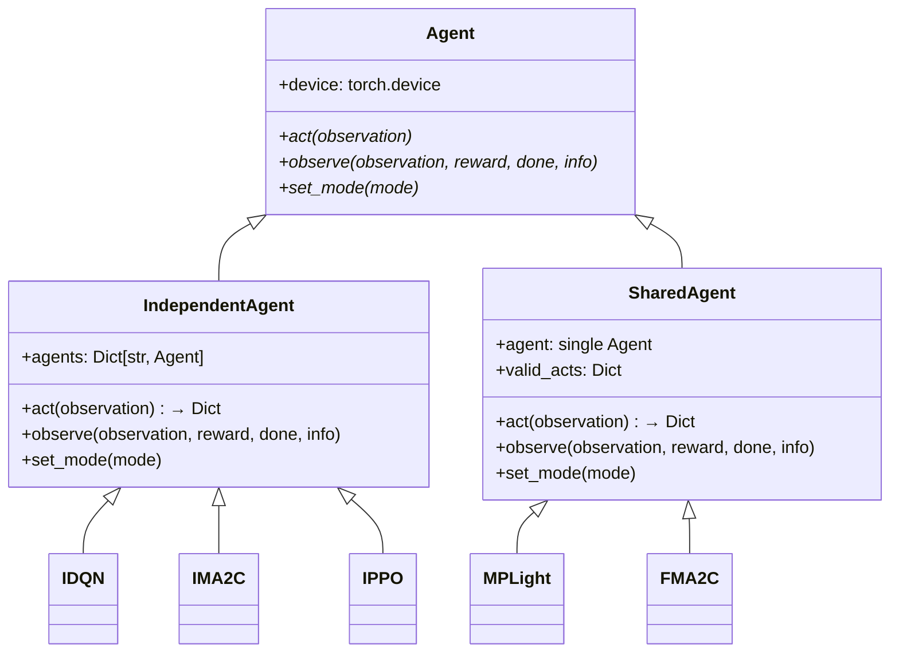
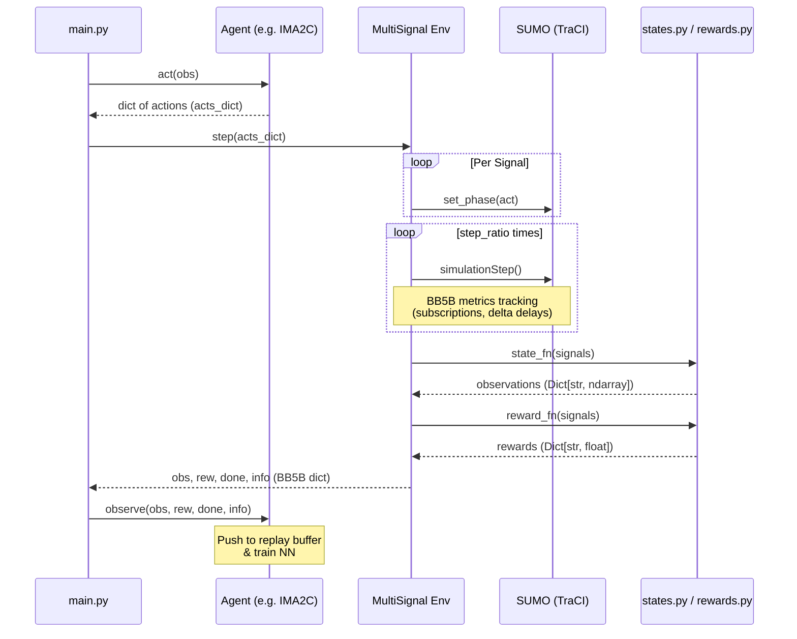
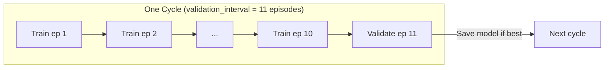
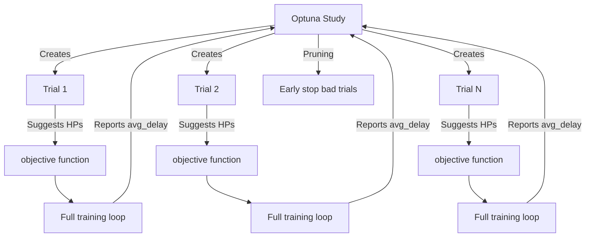

# RESCO Benchmark: BB5B Environment Architecture

Welcome to the **RESCO Traffic Benchmark** deep dive! This document provides a comprehensive structural overview of the RESCO codebase, focusing specifically on the **BB5B (Bandar Baru Bangi)** environment. If you want to understand how data flows from the SUMO simulation through the Reinforcement Learning (RL) agents and back, you are in the right place.

We'll dissect `main.py`, explore its core imports (`multi_signal.py`, `agents/`, `config/`), and illustrate exactly *what* data is exchanged at every step.

---

## 1. High-Level Architecture Flowchart

The execution is orchestrated by `main.py`. It pulls in environment configurations, initializes the RL agent, and runs the episodic training loop connecting the `MultiSignal` gym environment to the `Agent`.



---

## 2. The BB5B Map: Three Junctions of Bandar Baru Bangi

BB5B models a real-world three-intersection corridor in Bandar Baru Bangi, Selangor, Malaysia. Unlike the synthetic grid environments (e.g., `grid4x4`), BB5B uses **real traffic demand data** (vehicle routes, types, and departure schedules) captured from field observations.

### 2.1 The Three Controlled Intersections

| Junction ID | Description | Number of Phases | Inbound Directions |
|:---|:---|:---:|:---|
| `INFMain_Junc` | The main intersection at Informatics (northern junction) | 3 green phases | N, E, S, W |
| `PBB_Junc` | Persiaran Bandar Baru junction (central/southern junction) | 4 green phases | N, E, S, W |
| `SIRIM_Junc` | SIRIM junction (eastern junction) | 4 green phases | N, E, S, W |

Each junction has its own `Signal` object in the simulation. The three junctions form a connected network where downstream traffic from one junction feeds into the incoming lanes of its neighbors (defined in `signal_config.py`).

### 2.2 Map Timing Configuration (from `map_config.py`)

```python
'BB5B': {
    'net': 'environments/BB5B/BB5B.sumocfg',
    'route': None,        # Routes loaded from .rou.xml files inside the sumocfg
    'step_length': 10,    # Agent decision frequency: every 10 seconds
    'yellow_length': 3,   # Yellow light duration: 3 seconds
    'step_ratio': 1,      # Number of SUMO simulation steps per RL step
    'start_time': 25200,  # 7:00 AM in seconds (overridden by --validation_period)
    'end_time': 28800,    # 8:00 AM in seconds (overridden by --validation_period)
    'warmup': 0           # No warmup period
}
```

The `start_time` and `end_time` are dynamically overridden based on the `--validation_period` CLI argument (e.g., `"7-8am"` → 25200–28800s). This is handled by `utils/time_utils.py`.

### 2.3 Routes Tracked for Evaluation

The BB5B environment tracks 14 key routes for detailed per-route metrics during evaluation:

`Infout-HLin`, `PBBN-FMin`, `PBBN-SirimS`, `PBBN-SirimW`, `PBBN-SKE`, `PBBW-FMin`, `PBBW-SKE`, `SirimE-HLin`, `SirimS-HLin`, `SirimS-PBBN`, `SirimW-HLin`, `SirimW-SirimE`, `SKE-HLin`, `SKE-PBBN`

Each route name encodes the origin and destination of vehicles (e.g., `PBBN-SirimS` = vehicles entering from PBB North heading toward SIRIM South).

---

## 3. Core Modules & Data Types

### 3.1 `main.py` — The Orchestrator

The entry point of the training pipeline. 

- **Role**: Parses command-line arguments (e.g., `--agent IMA2C`, `--map BB5B`), determines the multiprocessing strategy, sets random seeds, and invokes the `run_trial` loop.
- **BB5B Specifics**: Modifies `start_time` and `end_time` dynamically based on the `--validation_period` string (e.g., `"7-8am"`). Cycles between `"training"` and `"validation"` modes every `--validation_interval` steps, utilizing MLflow to log detailed routing metrics.
- **Data Extracted/Generated**: 
  - `args`: Parsed namespace containing simulation parameters.
  - `dict_with_agents`: Dictionary mapping validation episode numbers to key stats like `"count_of_vehicles_completing_journey"` to select the best model.

**Key CLI Arguments:**

| Argument | Default | Purpose |
|:---|:---|:---|
| `--agent` | `STOCHASTIC` | RL algorithm to use (IDQN, IMA2C, IPPO, etc.) |
| `--map` | `BB5B` | Environment map |
| `--eps_val` | `10` | Number of validation episodes per cycle |
| `--validation_interval` | `11` | Train for N-1 episodes, validate on Nth |
| `--validation_day` | `26NovFull` | Traffic demand day (route file directory) |
| `--validation_period` | `7-8am` | Time window for simulation |
| `--net` | `default` | Neural network architecture variant |
| `--activation` | `relu` | Activation function (relu, leaky_relu) |
| `--seed` | `42` | Random seed for reproducibility |
| `--reward-type` | `queue_maxwait` | Reward function name |

### 3.2 `config/` — Agent, MDP, and Map Configurations

Before initializing the environment or agent, `main.py` resolves three configuration dictionaries.

#### `agent_configs` (Agent Hyperparameters)

Maps agent name strings to their class, observation function, reward function, and hyperparameters. Two primary agents used for BB5B:

**IDQN (Independent Deep Q-Network):**
```python
'IDQN': {
    'agent': IDQN,
    'state': states.drq_norm,        # Normalized per-lane observation
    'reward': rewards.wait_norm,     # Clipped normalized total wait
    'max_distance': 200,             # Vehicle detection range (meters)
    'BATCH_SIZE': 256,
    'GAMMA': 0.99,
    'EPS_START': 1.0,                # ε-greedy starts at 100% exploration
    'EPS_END': 0.0,                  # Decays to 0% (fully greedy)
    'EPS_DECAY': 220,                # Decay rate parameter
    'TARGET_UPDATE': 500             # Target network update frequency (steps)
}
```

**IMA2C (Independent Multi-Agent Advantage Actor-Critic):**
```python
'IMA2C': {
    'agent': IMA2C,
    'state': states.ma2c,                          # Neighborhood-aware wave + wait observation
    'reward': rewards.queue_maxwait_neighborhood,   # Neighborhood-cooperative reward
    'max_distance': 200,
    'rmsp_alpha': 0.99,         # RMSProp optimizer alpha
    'rmsp_epsilon': 1e-5,       # RMSProp optimizer epsilon
    'max_grad_norm': 40,        # Gradient clipping threshold
    'gamma': 0.96,              # Discount factor
    'lr_init': 2.5e-4,          # Initial learning rate
    'entropy_coef': 0.01,       # Entropy regularization coefficient
    'value_coef': 0.5,          # Value loss coefficient
    'num_hidden': 128,          # Hidden layer size in MLP
    'num_gru': 64,              # GRU hidden state size
    'batch_size': 120,          # Batch size for updates
    'reward_norm': 2000.0,      # Reward normalization divisor
    'reward_clip': 2.0          # Reward clipping range [-clip, clip]
}
```

#### `mdp_configs` (MDP Parameters for MA2C/FMA2C)

Defines normalization and clipping constants used by state and reward functions. For BB5B's MA2C configuration:

```python
'MA2C': {
    'BB5B': {
        'coop_gamma': 0.9,     # Discount factor for neighbor observations
        'clip_wave': 4.0,      # Max clipped wave value
        'clip_wait': 4.0,      # Max clipped wait value
        'norm_wave': 5.0,      # Normalization divisor for wave counts
        'norm_wait': 100.0     # Normalization divisor for wait times (seconds)
    }
}
```

The FMA2C BB5B config additionally defines a **management hierarchy** organizing the three junctions into two regions:
- `top_mgr`: manages `INFMain_Junc` and `SIRIM_Junc`
- `bot_mgr`: manages `PBB_Junc`

#### `map_configs` (Map Layout)

Specifies the SUMO network file, route file, step lengths, timing, and which intersections to control! Covered in detail in §2.2 above.

### 3.3 `traffic_signal.py` — The `Signal` Class

Each controlled intersection in the simulation is represented by a `Signal` object. This class is the critical bridge between SUMO's TraCI API and the RL environment.

#### Core Properties

| Property | Type | Description |
|:---|:---|:---|
| `id` | `str` | Junction ID (e.g., `"PBB_Junc"`) |
| `lanes` | `List[str]` | All inbound lane IDs controlled by this signal |
| `outbound_lanes` | `List[str]` | Outbound lanes (used for pressure calculations) |
| `lane_sets` | `Dict[str, List[str]]` | Lanes grouped by direction (e.g., `"N-S"`, `"E-W"`) |
| `downstream` | `Dict[str, Optional[str]]` | Map of direction → downstream signal ID |
| `phase` | `int` | Current traffic light phase index (from SUMO) |
| `full_observation` | `Dict` | Complete per-lane observation data (set by `observe()`) |
| `waiting_times` | `Dict[str, float]` | Manually tracked per-vehicle waiting times |
| `yellow_time` | `int` | Duration of yellow phase (3s for BB5B) |
| `min_green` | `int` | Minimum green time before switching (5s) |
| `max_green` | `int` | Maximum green time forcing a switch (90s) |

#### Phase Structure

Each signal alternates through a repeating cycle: **Green → Yellow → Red → Green → ...**

Phases are stored in groups of three:
- Phase `0, 3, 6, ...` = Green phases (RL agent controls which green phase to use)
- Phase `1, 4, 7, ...` = Yellow phases (transition)
- Phase `2, 5, 8, ...` = All-red phases (safety clearance, 2 seconds)

The RL agent's binary action controls whether to **keep** the current green phase (`action=0`) or **switch** to the next green phase (`action=1`). Switching is blocked if the current phase hasn't been green for at least `min_green + yellow_time + red_time` seconds.

#### `signal.observe()` — Per-Lane Data Collection

When called, `observe()` queries SUMO via TraCI for each inbound lane and builds `full_observation`:

```python
full_observation[lane_id] = {
    'queue': int,         # Number of stopped vehicles (waiting_time > 0)
    'approach': int,      # Number of approaching vehicles (moving)
    'total_wait': float,  # Sum of all vehicles' waiting times on this lane
    'max_wait': float,    # Maximum single-vehicle wait time on this lane
    'vehicles': [         # List of per-vehicle dicts
        {
            'id': str,            # SUMO vehicle ID
            'wait': float,        # Individual waiting time (seconds)
            'speed': float,       # Current speed (m/s)
            'acceleration': float,# Current acceleration (m/s²)
            'position': float,    # Position along the lane (meters)
            'type': str           # Vehicle type ID
        },
        ...
    ]
}

# Additionally tracked at the signal level:
full_observation['num_vehicles'] = set()    # All vehicle IDs near this signal
full_observation['arrivals'] = set()        # Vehicles that appeared since last step
full_observation['departures'] = set()      # Vehicles that left since last step
```

**Vehicle detection range**: Only vehicles within `max_distance` meters (default: 200m) of the traffic light are detected. This simulates real-world detector limitations.

**Waiting time tracking**: SUMO's built-in waiting time is inaccurate for multi-signal networks, so the `Signal` class maintains its own `waiting_times` dictionary. A vehicle's wait time is incremented by `step_length` each step while it remains stopped, and cleared when it departs the signal's detection zone.

#### `signal.prep_phase(action)` — Action Execution

```
action = 0  →  Keep current green phase (no change)
action = 1  →  Switch to next green phase:
               1. Set yellow phase immediately (phase + 1)
               2. After yellow_time seconds → set red phase (phase + 2)
               3. After red_time seconds→ set next green phase (phase + 3, or wrap to 0)
```

The minimum green constraint prevents rapid phase cycling: a switch is only allowed if `time_since_last_phase_change >= min_green + yellow_time + red_time` (= 5 + 3 + 2 = 10 seconds for BB5B).

---

## 4. State Functions — Observation Builders (`states.py`)

All state functions take a `signals` dictionary (mapping `signal_id` → `Signal` object) and return a dictionary mapping `signal_id` → `np.ndarray`. Each function reads different features from `signal.full_observation`.

### 4.1 `drq(signals)` — Raw DRQ Observation

Used by: none by default (unnormalized variant of `drq_norm`).

For each signal, builds a 2D observation matrix with shape `(1, num_lanes, 5)`:

| Index | Feature | Source |
|:---:|:---|:---|
| 0 | Active phase indicator | `1` if this lane's phase is active, `0` otherwise |
| 1 | Approach count | `full_observation[lane]['approach']` |
| 2 | Total wait time | `full_observation[lane]['total_wait']` (raw seconds) |
| 3 | Queue length | `full_observation[lane]['queue']` |
| 4 | Total speed | Sum of all vehicle speeds on lane |

Returns: `Dict[str, np.ndarray]` — shape `(1, num_lanes, 5)` per signal.

### 4.2 `drq_norm(signals)` — Normalized DRQ *(used by IDQN)*

Same structure as `drq`, but normalizes features by dividing approach, wait, and queue by 28 (approximate lane capacity) and speed by `20 × 28`. This keeps all feature values in a similar scale for neural network training.

### 4.3 `wave(signals)` — Aggregate Wave Count

Used by: `MAXWAVE`.

Simple observation: for each directional lane set, sums `queue + approach` to get the total "wave" of vehicles. Returns a 1D vector per signal with one entry per direction.

### 4.4 `mplight(signals)` — MPLight Observation

Used by: `MAXPRESSURE`, `MPLight`.

Similar to wave but also subtracts downstream queue lengths (pressure-aware):

```
obs[direction] = Σ(queue_inbound) - Σ(queue_downstream)
```

This gives a net "pressure" per direction, prepended by the current phase index.

### 4.5 `mplight_full(signals)` — Extended MPLight

Extends `mplight` with additional per-direction features: `total_wait/28`, `total_speed`, and `approach/28`.

### 4.6 `ma2c(signals)` — MA2C Cooperative Observation *(used by IMA2C)*

This is the most sophisticated observation function, used by both IMA2C and MA2C agents. It constructs a **neighborhood-aware** observation:

**Step 1 — Compute per-signal wave vectors:**
```
wave[lane] = (queue + approach) for each lane
signal_wave[signal_id] = clip(wave / norm_wave, 0, clip_wave)
```
Where `norm_wave = 5.0` and `clip_wave = 4.0` for BB5B.

**Step 2 — Incorporate neighbor observations:**
```
waves = [own_wave] + [coop_gamma × neighbor_wave for each downstream neighbor]
```
Where `coop_gamma = 0.9`, so each neighbor's wave is discounted to 90%.

**Step 3 — Add per-lane maximum wait times:**
```
waits[lane] = clip(max_wait / norm_wait, 0, clip_wait)
```
Where `norm_wait = 100.0` seconds and `clip_wait = 4.0`.

**Final observation** = concatenation of `[waves, waits]`.

The observation vector length varies per signal depending on how many downstream neighbors exist. For a signal with 8 inbound lanes and 2 neighbors (each with 8 lanes), the observation might be: `8 + 8 + 8 + 8 = 32` values (own waves + 2×neighbor waves + own waits).

### 4.7 `fma2c(signals)` — Federated MA2C

Extends `ma2c` with a hierarchical management layer. Region managers observe fringe lanes (lanes at the boundary between regions), and manager-level observations are appended to the observation dict. Used by the `FMA2C` agent.

---

## 5. Reward Functions (`rewards.py`)

All reward functions take `signals` and return `Dict[str, float]`. Rewards are always **negative** penalties (the agent learns to minimize delays).

### 5.1 `wait(signals)` — Raw Wait Penalty

```
reward[signal_id] = -Σ(total_wait on each lane)
```

Simply sums the total waiting time across all inbound lanes. Larger queues and longer waits produce more negative rewards.

### 5.2 `wait_norm(signals)` — Normalized Wait *(used by IDQN)*

```
reward[signal_id] = clip(-total_wait / 224, -4, 4)
```

Divides by `224` (= 8 lanes × 28 max vehicles per lane) and clips to `[-4, 4]`. Output is `np.float32`.

### 5.3 `pressure(signals)` — Intersection Pressure

```
reward[signal_id] = -(Σ queue_inbound - Σ queue_downstream)
```

Queue pressure: penalizes net accumulation of vehicles. If downstream is also congested, the penalty is reduced.

### 5.4 `queue_maxwait(signals)` — Queue + Max Wait Penalty

```
reward[signal_id] = -Σ(queue[lane] + 0.4 × max_wait[lane])
```

Combines queue length with maximum waiting time (weighted at 0.4). This directly penalizes both the number of stopped vehicles and how long the longest-waiting vehicle has been stopped.

### 5.5 `queue_maxwait_neighborhood(signals)` — Cooperative Reward *(used by IMA2C)*

Builds on `queue_maxwait` but adds **discounted neighbor rewards**:

```
reward[signal_id] = own_reward + Σ(0.9 × neighbor_reward)
```

Each signal is penalized not only for its own congestion but also for congestion at its downstream neighbors. The discount factor `0.9` ensures the local reward dominates while still encouraging cooperation. This is the **default reward for IMA2C on BB5B**.

---

## 6. Agent Architecture (`agents/`)

### 6.1 Class Hierarchy



### 6.2 `IndependentAgent` — How IDQN and IMA2C Work

The key design pattern: **one sub-agent per traffic signal**. For BB5B with 3 junctions, the `IndependentAgent` creates 3 independent neural networks, one for `INFMain_Junc`, one for `PBB_Junc`, and one for `SIRIM_Junc`.

**`act(observation)`:**
```python
# observation = {"INFMain_Junc": np.ndarray, "PBB_Junc": np.ndarray, "SIRIM_Junc": np.ndarray}
for agent_id in observation:
    acts[agent_id] = self.agents[agent_id].act(observation[agent_id])
# acts = {"INFMain_Junc": 0 or 1, "PBB_Junc": 0 or 1, "SIRIM_Junc": 0 or 1}
```

**`observe(observation, reward, done, info)`:**
```python
# Each sub-agent receives its own observation and reward independently
for agent_id in observation:
    self.agents[agent_id].observe(observation[agent_id], reward[agent_id], done, info)
    # Internally: pushes (obs, act, rew, next_obs, done) to replay buffer, runs backprop
```

### 6.3 `SharedAgent` — How MPLight and FMA2C Work

Unlike `IndependentAgent`, `SharedAgent` uses a **single neural network** shared across all signals. Observations from all signals are batched together for efficient inference and training:

```python
# Batch all signal observations into a single forward pass
batch_obs = [observation[agent_id] for agent_id in observation]
batch_acts = self.agent.act(batch_obs)  # Single NN processes all signals at once
```

### 6.4 IDQN Neural Network Details

IDQN uses a standard DQN architecture (via PFRL library):
- **Input**: Flattened `drq_norm` observation vector per signal
- **Network**: MLP with configurable hidden layers  
- **Output**: Q-values for 2 actions (keep phase vs. switch phase)
- **Training**: Experience replay buffer (default 50,000 transitions) + target network (updated every 500 steps)
- **Exploration**: ε-greedy with exponential decay from `EPS_START=1.0` to `EPS_END=0.0`

### 6.5 IMA2C Neural Network Details

IMA2C uses an Actor-Critic architecture with GRU (via PFRL library):
- **Input**: `ma2c` observation vector (neighborhood-aware waves + waits)
- **Network**: GRU (hidden size `num_gru=64`) → MLP (hidden size `num_hidden=128`)
- **Actor head**: Outputs action probabilities (2 actions)
- **Critic head**: Outputs state value estimate V(s)
- **Training**: On-policy batched updates (batch size 120), RMSProp optimizer
- **Regularization**: Entropy coefficient (`entropy_coef=0.01`) encourages exploration; gradient clipping (`max_grad_norm=40`) prevents instability
- **Reward processing**: Rewards are divided by `reward_norm=2000.0` and clipped to `[-2, 2]`

### 6.6 Training vs. Validation Mode

All agents implement `set_mode(mode)` which switches between:

| Mode | IDQN Behavior | IMA2C Behavior |
|:---|:---|:---|
| `"training"` | ε-greedy exploration, replay buffer updates, gradient steps | Stochastic policy sampling, gradient updates |
| `"validation"` | Greedy action selection (no exploration), no learning | Deterministic (argmax) policy, no learning |

---

## 7. The Trajectory Loop — Detailed Sequence

### 7.1 Full Step Sequence Diagram



### 7.2 Training/Validation Cycle

The training loop in `main.py` runs `eps_val × validation_interval` total episodes (default: `10 × 11 = 110`):



- **Training episodes** (10 per cycle): Agent explores and learns. Models are updated.
- **Validation episode** (1 per cycle): Agent runs greedily (no exploration). Key metrics recorded:
  - `count_of_vehicles_completing_journey` — Higher is better
  - `total_average_delays_of_all_vehicles_from_all_routes` — Lower is better
- **Best model selection**: After all cycles, the validation episode with the most vehicles completing their journey (and lowest delay as tiebreaker) is chosen. Its model weights are zipped and logged as an MLflow artifact.

---

## 8. The `info` Dictionary — Complete Breakdown

The `info` dict returned by `env.step()` contains the richest data payload. Its contents differ significantly between mid-episode steps (`done=False`) and episode-end (`done=True`).

### 8.1 Per-Step Info (`done=False`)

| Key | Type | Description |
|:---|:---|:---|
| `action` | `Dict[str, int]` | Actions taken per signal (e.g., `{"INFMain_Junc": 1}`) |
| `reward` | `Dict[str, float]` | Rewards per signal |
| `current_number_of_vehicles` | `int` | Vehicles currently in the simulation |
| `number_of_halting_vehicles_...on_incoming_lanes` | `int` | Stopped vehicles on inbound lanes |
| `number_of_all_halting_vehicles_...in_simulation` | `int` | Total stopped vehicles in entire network |
| `waiting_time_all_vehicles_...in_simulation` | `float` | Sum of all vehicle wait times |
| `calculate_average_delta_of_delays_after_action` | `float` | Change in average delay after the action |
| `number_of_vehicles_that_passed_...in_last_steps` | `int` | Vehicles that passed through intersections |
| `current_average_delays_of_all_vehicles_in_simulation` | `float` | Real-time average delay |

### 8.2 Episode-End Info (`done=True`) — Additional Fields

All per-step fields are included, plus these episode-summary metrics:

| Key | Type | Description |
|:---|:---|:---|
| `count_of_all_vehicles_in_simulation` | `int` | Total vehicles that appeared during the episode |
| `count_of_vehicles_completing_journey` | `int` | Vehicles that reached their destination |
| `total_time_of_journey` | `float` | Sum of all journey times |
| `average_time_of_journey` | `float` | Mean journey time per vehicle |
| `total_sum_delays_of_all_vehicles_from_all_routes` | `float` | Sum of delays across all routes |
| `total_average_delays_of_all_vehicles_from_all_routes` | `float` | **Primary evaluation metric** |
| `total_average_delays_real_times_by_ideal_times` | `float` | Delay ratio (actual/ideal travel time) |
| `total_average_delays_with_weights` | `float` | Weighted delay considering route importance |
| `total_average_delays_..._completing_and_not_completing` | `float` | Average delay including stuck vehicles |
| `total_waiting_time_on_the_incoming_lanes_in_episode` | `float` | Cumulative wait on incoming lanes |
| `routes` | `Dict[str, Dict]` | **Per-route detailed breakdown** (see below) |

### 8.3 Per-Route Info (`info["routes"][route_id]`)

Each route in the `routes` dictionary contains:

| Key | Type | Description |
|:---|:---|:---|
| `length` | `float` | Route length in meters |
| `total_number_of_all_vehicles_generated-ThruPut_Scheduled` | `int` | Vehicles scheduled on this route |
| `total_number_of_all_vehicles_completing_journey-ThruPut_Actual` | `int` | Vehicles that completed this route |
| `throughput_of_the_route-ThruPut_Idx` | `float` | Ratio: actual/scheduled throughput |
| `total_travel_time_of_all_vehicles` | `list` | Per-vehicle travel times |
| `total_average_travel_time_of_all_vehicles` | `float` | Mean travel time |
| `total_delays_of_all_vehicles` | `list` | Per-vehicle delays |
| `total_average_delays_of_all_vehicles-Delay_Idx_Average` | `float` | Mean delay |
| `Delay_Idx_StDev` | `float` | Standard deviation of delays |
| `total_average_delays_of_all_vehicles_with_weights` | `float` | Weighted delay metric |

---

## 9. Optuna Hyperparameter Tuning (`main-o.py`)

`main-o.py` wraps the entire training pipeline with **Optuna** for automated hyperparameter search. Each Optuna "trial" runs a full training loop with different suggested hyperparameters.

### 9.1 Architecture



### 9.2 Hyperparameter Search Spaces

**IDQN search space:**

| Parameter | Type | Range |
|:---|:---|:---|
| `BATCH_SIZE` | categorical | [32, 64, 128, 256] |
| `GAMMA` | categorical | [0.9, 0.95, 0.98, 0.99] |
| `EPS_END` | float | [0.0, 0.05] |
| `EPS_DECAY` | categorical | [100, 220, 500] |
| `TARGET_UPDATE` | int | [500, 5000], step=500 |
| `LR` | float (log) | [1e-5, 1e-3] |
| `REWARD` | categorical | [wait_norm, queue_maxwait, pressure] |
| `REPLAY_BUFFER_SIZE` | categorical | [10000, 50000, 100000] |

**IMA2C search space:**

| Parameter | Type | Range |
|:---|:---|:---|
| `LR` | float (log) | [1e-5, 1e-3] |
| `GAMMA` | categorical | [0.95, 0.96, 0.99] |
| `ENTROPY_COEF` | float (log) | [1e-4, 1e-1] |
| `VALUE_COEF` | float | [0.1, 1.0] |
| `NUM_HIDDEN` | categorical | [64, 128, 256] |
| `NUM_GRU` | categorical | [32, 64, 128] |
| `BATCH_SIZE` | categorical | [64, 120, 256] |
| `REWARD_NORM` | categorical | [1000, 2000, 5000] |
| `REWARD` | categorical | [wait_norm, queue_maxwait, pressure, queue_maxwait_neighborhood] |

### 9.3 Pruning

Optuna monitors `total_average_delays_of_all_vehicles_from_all_routes` at each validation checkpoint. Using the **Hyperband pruner** (default), poorly performing trials are stopped early, saving compute time.

### 9.4 Best Model Selection

After all trials complete, the `SaveBestModelCallback` automatically archives the best model zip (the one with the lowest average delay) to the `models/optuna/` directory.

---

## 10. MLflow Logging Architecture (`utils/mlflow_logger.py`)

All experiment tracking uses MLflow, storing data in a local SQLite database (`resco_benchmark/mlflow.db`).

### 10.1 What Gets Logged

| Category | Logged When | Examples |
|:---|:---|:---|
| **Parameters** | Run start | algorithm, activation, seed, validation_period, phases, batch_size |
| **Tags** | Run start | agent, net, group_tag, optuna_study, optuna_trial |
| **Episode metrics** | `done=True` | count_of_vehicles, avg_delay, avg_journey_time, route throughputs |
| **Per-route metrics** | `done=True` | throughput index, average delay per route |
| **Per-route text** | `done=True` | Full per-vehicle travel time and delay lists |
| **Model artifacts** | End of run | Best model `.zip` file |
| **Optuna metrics** | Validation step | optuna/avg_delay, optuna/vehicles_completed |

Per-step metrics (actions, rewards, vehicle counts at each simulation step) are available but **commented out by default** to keep the database lean.

### 10.2 Experiment Naming Convention

- Regular runs: `{agent}-sumo-{map}` (e.g., `IDQN-sumo-BB5B`)
- Optuna runs: `{agent}-sumo-{map}-optuna` (e.g., `IDQN-sumo-BB5B-optuna`)

### 10.3 Accessing Results

The MLflow UI can be launched with:
```bash
mlflow server \
    --backend-store-uri sqlite:///resco_benchmark/mlflow.db \
    --default-artifact-root ./mlartifacts \
    --host 0.0.0.0 --port 5000
```

---

## 11. Summary of Data and DataTypes

| Object/Variable | Originates From | Consumed By | Datatype format | Description |
| :--- | :--- | :--- | :--- | :--- |
| `agt_config` | `config/agent_config.py` | `main.py`, `Agent` | `dict` | hyperparameters, NN sizes, distance ranges |
| `act` | `Agent.act()` | `MultiSignal.step()` | `Dict[str, int]` | Phase control binary/index for each traffic light |
| `obs` | `states.py` | `main.py` & `Agent` | `Dict[str, np.ndarray]` | Features like queues, wait times normalized by max constraints |
| `rew` | `rewards.py` | `main.py` & `Agent` | `Dict[str, float]` | Penalties calculated from max queues and wait times |
| `info` | `MultiSignal.step()` | `main.py` (Validation) | `Dict[str, Any]` | Ints, Floats, and Dicts outlining the detailed systemic evaluation of the BB5B experiment. |
| `full_observation` | `Signal.observe()` | `states.py`, `rewards.py` | `Dict[str, Dict]` | Per-lane vehicle counts, speeds, waits, queues |
| `signal_wave` | `states.ma2c()` | `states.ma2c()` | `Dict[str, np.ndarray]` | Clipped normalized wave counts per signal |
| `PARAMS_ALGORITHM` | `main.py` / `main-o.py` | MLflow | `dict` | All hyperparameters logged as run parameters |

---

## 12. File Reference Map

```
resco_benchmark/
├── main.py                      # Standard training orchestrator
├── main-o.py                    # Optuna hyperparameter tuning wrapper
├── multi_signal.py              # MultiSignal gym environment (SUMO interface)
├── traffic_signal.py            # Signal class (per-junction logic)
├── states.py                    # Observation builder functions (7 variants)
├── rewards.py                   # Reward calculator functions (5+ variants)
├── config/
│   ├── agent_config.py          # Agent hyperparameters & class mappings
│   ├── map_config.py            # SUMO network files, timing, step lengths
│   ├── mdp_config.py            # MDP normalization constants & management hierarchies
│   └── signal_config.py         # Per-junction lane sets & downstream connectivity
├── agents/
│   ├── agent.py                 # Base Agent, IndependentAgent, SharedAgent
│   ├── pfrl_dqn.py              # IDQN implementation (PFRL DQN wrapper)
│   ├── pfrl_ppo.py              # IPPO implementation
│   ├── pfrl_ma2c.py             # IMA2C implementation (Actor-Critic with GRU)
│   ├── mplight.py               # MPLight implementation (shared DQN)
│   ├── fma2c.py                 # FMA2C implementation (federated MA2C)
│   ├── maxwave.py               # MAXWAVE rule-based baseline
│   ├── maxpressure.py           # MAXPRESSURE rule-based baseline
│   └── stochastic.py            # Random action baseline
├── utils/
│   ├── mlflow_logger.py         # MLflow init, metric logging, artifact upload
│   └── time_utils.py            # Validation period string parser
└── environments/
    └── BB5B/
        ├── BB5B.sumocfg         # SUMO configuration file
        ├── BB5B.net.xml         # Road network definition
        └── [route files]        # Traffic demand per day/period
```
