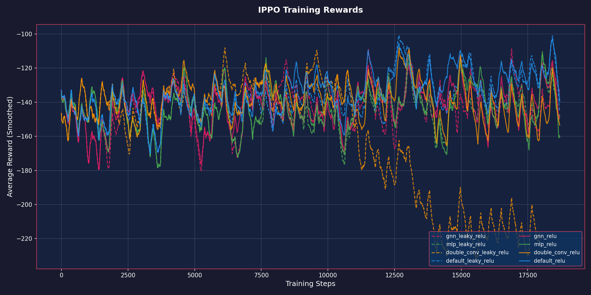
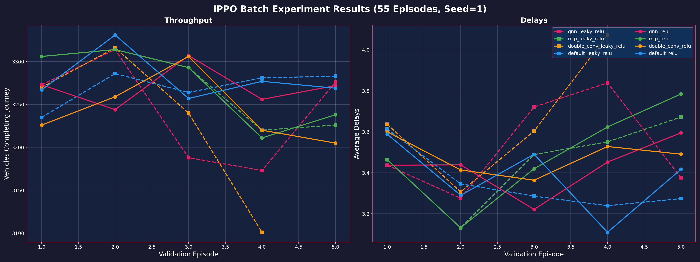
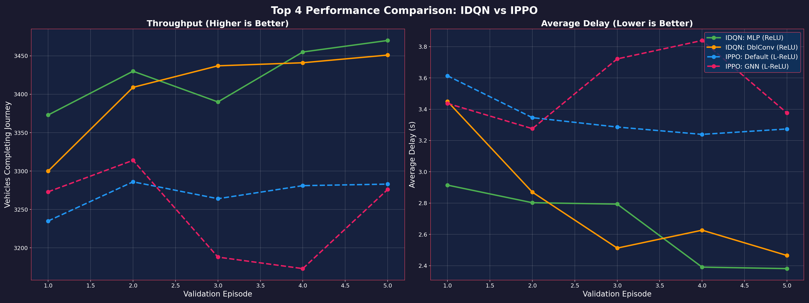

# Experimentation: PPO Model Architectures & Activation Functions
**Date**: Feb 15, 2026  
**Agent**: IPPO (Independent Proximal Policy Optimization)  
**Environment**: BB5B (Malaysia Map)  
**Experiment Group**: PPO Batch (55 Episodes)

## 1. Introduction
This report analyzes the performance of the **Independent PPO (IPPO)** agent across four neural network architectures and two activation functions. We compare these results directly against the previously benchmarked **IDQN** agent to evaluate the efficacy of policy gradient methods versus value-based methods in this traffic control scenario.

---

## 2. Model Architectures
The **IPPO** agent uses an Actor-Critic architecture where each intersection independently learns a policy $\pi(a|s)$ and a value function $V(s)$.

### Neural Network Variants
Tested with **ReLU** and **Leaky ReLU** activations:
1.  **Default**: Shallow CNN (1 Conv + 2 FC).
2.  **Double Conv**: Deeper CNN (2 Conv + 2 FC).
3.  **MLP (v2)**: Deep Fully Connected (5 layers, 256 units, LayerNorm).
4.  **GNN (v2)**: Multi-Head Attention (4 heads, Residuals, LayerNorm).

### Neptune Trial IDs (Reference)
**Workspace**: sathyakumar/Tensorcell-test
[Neptune Dashboard](https://app.neptune.ai/sathyakumar/Tensorcell-test/) | **Seed=1**

| Run ID | Net | Activation |
| :--- | :--- | :--- |
| **TEN-91** | default | relu |
| **TEN-92** | double_conv | relu |
| **TEN-93** | mlp | relu |
| **TEN-94** | gnn | relu |
| **TEN-95** | default | leaky_relu |
| **TEN-96** | double_conv | leaky_relu |
| **TEN-97** | mlp | leaky_relu |
| **TEN-98** | gnn | leaky_relu |

---

## 3. Training Progress (Rewards)
Average rewards (INFMain, PBB, SIRIM) smoothed over training steps.

**Observation**: PPO training is significantly more volatile than IDQN. `mlp_leaky_relu` and `gnn_leaky_relu` show the most consistent improvement, while ReLU variants appear more unstable or stagnant in later stages.

---

## 4. Evaluation Results: Throughput & Delays

### Performance Matrix (Final Validation Point - Ep 55)
| Model Combination | Throughput (Veh) | Delay Index (TTI)* |
| :--- | :---: | :---: |
| **Default (CNN) + Leaky ReLU** | **3283** | **3.27** |
| **GNN + Leaky ReLU** | 3276 | 3.38 |
| **Double Conv + Leaky ReLU*** | 3101 | 4.07 |
| **MLP + Leaky ReLU** | 3226 | 3.67 |
| **Default + Relu** | 3269 | 3.42 |
| **MLP + ReLU** | 3238 | 3.78 |

*\*Note: Delay Index (Travel Time Index) = Average Ratio of Actual Travel Time to Free Flow Time. Lower is better. A value of 3.27 means travel takes ~3.3x the ideal time. This metric was previously labeled "Avg Delay (s)" but inspection confirmed it is a ratio.*

### Training Average Performance (All Episodes)
For consistent comparison with IDQN and IMA2C, we report the average performance across all 55 training episodes:
- **Throughput**: ~3341 Veh/Episode
- **Delay Index (TTI)**: ~4.09
- *Note: IPPO shows high variance, and training averages reflect the exploration noise.*

---

## 5. COMPARISON: IPPO vs IDQN

### Head-to-Head Performance (Top 4 Models)

Comparing the best configurations from both agents:

| Metric | **Best IDQN** (MLP+ReLU) | **Best IPPO** (Default+LeakyReLU) | Difference |
| :--- | :---: | :---: | :---: |
| **Throughput** | **3470** | 3283 | IDQN +5.7% |
| **Delay Index** | **2.38** | 3.27 | IDQN -27.2% |

### Conclusions
1.  **IDQN Superiority**: IDQN significantly outperforms IPPO in this environment. It clears **~164 more vehicles** per episode and maintains a **Travel Time Index (TTI)** closer to free-flow (2.38 vs 3.27).
2.  **Activation Sensitivity**: Unlike IDQN which preferred **ReLU**, IPPO shows a preference for **Leaky ReLU**. The Leaky ReLU variants (MLP, GNN) generally achieved higher throughput than their ReLU counterparts, suggesting PPO benefits from the non-zero gradients for negative inputs to prevent dying neurons during policy updates.
3.  **Stability**: IPPO exhibits high variance and lower sample efficiency compared to IDQN. The value-based approach of IDQN appears better suited for the discrete, coordination-heavy nature of traffic signal control in this specific map.
4.  **Architecture Trends**: The **MLP (v2)** architecture consistently ranks top for IDQN, but for PPO, the simpler **Default CNN** and **GNN** models performed best in the final evaluation.

**Hypothesis**: My working hypothesis is that the GNN and deeper MLP architectures introduced too much complexity for the PPO agent to handle efficiently within 55 episodes. Since PPO generally has higher variance than DQN, trying to learn complex graph dependencies (attention weights) while simultaneously optimizing the policy likely made the landscape too difficult to navigate. The agent might have gotten stuck in local optima because it couldn't stabilize the representation learning and the policy updates at the same time. However, this is just my interpretation of the results; it's quite possible that with more extensive hyperparameter tuning or a different initialization strategy, these advanced models could perform much better.

---
